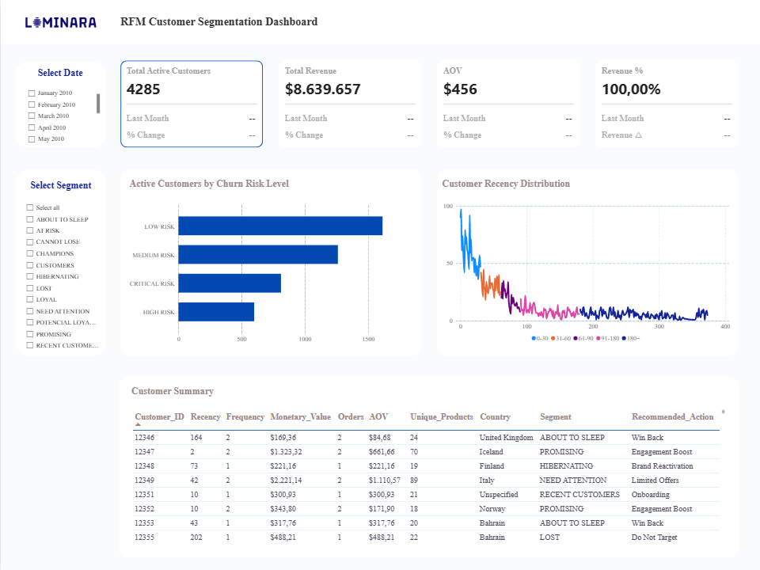

# Luminara RFM Customer Segmentation

[](Luminara_RFM_Dashboard.pbix)

```bash
rfm-customer-segmentation/
│
├── data_cleaning/
├── rfm_analysis/
├── Results/
├── Report/
│
├── README.md
└── Licence

```
## 1. Project Background & Overview

### Business Context

Luminara is a global e-commerce retailer specialising in home décor, giftware, and lifestyle products. Operating across a large international customer base, the business processes a high volume of relatively low-value transactions.

Historically, marketing activities were executed using a broad, undifferentiated approach in which all customers were treated similarly regardless of purchasing behaviour or customer value. As a result, the business lacked visibility into:

- its highest-value customers,
- early indicators of churn,
- and opportunities to nurture developing customer relationships.

### Problem Statement

The absence of a structured customer segmentation framework created several operational and commercial limitations:

- **Inefficient Marketing Allocation**:
  Marketing spend was distributed uniformly rather than prioritised toward high-value or high-potential customer groups.
- **Limited Churn Visibility**:
  High-value customers could become inactive without proactive retention intervention.
- **Missed Growth Opportunities**: 
  The business lacked a scalable framework to convert newer or moderately engaged customers into long-term loyal customers.

### Project Objectives

This project applies the RFM (Recency, Frequency, Monetary) framework to transform transactional data into actionable customer intelligence. The primary objectives were to:

- Segment customers based on purchasing behaviour,
- Identify revenue concentration across customer groups,
- Assess churn exposure,
and support more targeted retention and lifecycle marketing strategies.

### RFM Metrics

| Metric | Definition | Business Relevance |
|---|---|---|
| **Recency** | Days since the customer’s last purchase | Measures current engagement and potential churn risk |
| **Frequency** | Number of distinct transactions/invoices | Indicates repeat purchasing behaviour and customer loyalty |
| **Monetary Value** | Total revenue generated per customer | Measures customer value and revenue contribution |
---
## 2. Data Structure & Methodology

### Dataset Overview

The analysis utilised the *Online Retail II* dataset covering transactions between December 2009 and December 2010.

A key technical challenge was that several fields were originally stored as NVARCHAR (text), requiring a structured type-conversion process before aggregation and analysis could be performed reliably.

| Column | Description | Data Type |
|---|---|---|
| Invoice | Unique transaction identifier | `NVARCHAR` |
| StockCode | Product or transaction code | `NVARCHAR` |
| Description | Product description | `NVARCHAR` |
| Quantity | Number of units purchased | `INTEGER` |
| InvoiceDate | Transaction timestamp | `DATETIME2` |
| Price | Unit price (£) | `DECIMAL` |
| Customer_ID | Unique customer identifier | `INTEGER` |
| Country | Customer country | `NVARCHAR` |


### Data Cleaning & Transaction Classification

Rather than removing non-standard records entirely, transactions were classified to preserve operational context within the dataset.

A new `transaction_type` field was added to distinguish between:
- product purchases,
- cancellations,
- adjustments,
- discounts,
- and postage-related transactions.

Only valid product transactions with positive quantities and prices were included in the final RFM model. This ensured that customer metrics reflected genuine purchasing behaviour rather than operational corrections or accounting adjustments.

### RFM Scoring Methodology

The project utilised `PERCENT_RANK()` for frequency scoring instead of standard `NTILE()` segmentation.

Exploratory analysis revealed a highly skewed purchase distribution, where a substantial proportion of customers had only one recorded transaction. Using `NTILE()` would have grouped materially different purchasing behaviours into identical scoring bands.

`PERCENT_RANK()` provided greater scoring granularity and improved differentiation between low-, mid-, and high-engagement customers.
---
## 3. Executive Summary

### Key Findings

The analysis identified a significant concentration of revenue within a relatively small customer segment.

The **Champions** segment, consisting of 808 customers, generated approximately **63.26% (£5.47M)** of total revenue. This indicates a high level of commercial dependency on a limited proportion of the customer base.

In parallel, the **At Risk** segment represented the largest revenue recovery opportunity, contributing over **£806K** in historical revenue while showing declining engagement patterns.

### Strategic Implications

The findings suggest three immediate strategic priorities:

1. **Protect High-Value Customers**  
   Retain high-performing customer segments through loyalty and retention initiatives.

2. **Recover Declining Customers**  
   Implement targeted re-engagement workflows for customers showing signs of inactivity.

3. **Improve Marketing Efficiency**  
   Reduce acquisition and retention spend on low-probability inactive segments through greater automation.

---
## 4. Customer Segment Insights

### Revenue Contribution by Segment

| Segment | Customer Count | Total Revenue ($) | Revenue % |
|---|---:|---:|---:|
| CHAMPIONS | 808 | 5,465,483.55 | 63.26% |
| LOYAL | 387 | 896,221.80 | 10.37% |
| AT RISK | 378 | 806,580.01 | 9.34% |
| NEED ATTENTION | 226 | 282,802.90 | 3.27% |
| HIBERNATING | 658 | 270,735.26 | 3.13% |
| POTENTIAL LOYALIST | 344 | 223,763.92 | 2.59% |
| PROMISING | 207 | 194,284.89 | 2.25% |
| CANNOT LOSE | 104 | 187,740.79 | 2.17% |
| LOST | 558 | 119,350.49 | 1.38% |
| RECENT CUSTOMERS | 420 | 96,602.22 | 1.12% |
| ABOUT TO SLEEP | 190 | 73,654.85 | 0.85% |
| CUSTOMERS | 5 | 22,436.52 | 0.26% |

### Behavioural Profiles

| Segment | Avg. Freq | Avg. Order Value (AOV) | Repeat Purchase Rate | Avg. Unique Products |
|---|---:|---:|---:|---:|
| CHAMPIONS | 12 | $538.10 | 100% | 148 |
| AT RISK | 4 | $468.89 | 100% | 72 |
| CANNOT LOSE | 2 | $755.29 | 24.04% | 51 |
| LOYAL | 5 | $400.28 | 100% | 94 |
| POTENTIAL LOYALIST | 2 | $232.84 | 100% | 46 |
| PROMISING | 1 | $592.33 | 58.45% | 47 |

### Segment Interpretation

* **CHAMPIONS:**
  Champions represent the core revenue-driving segment. These customers purchase frequently, engage across a wide product range, and contribute the majority of total revenue.

* **AT RISK:**
   At Risk customers demonstrate historically strong purchasing behaviour but declining recent engagement. This segment represents the largest short-term retention opportunity.

* **CANNOT LOSE:**
 This segment consists of low-frequency but exceptionally high-value customers. Although purchase frequency is limited, average order values are significantly above the customer average, making retention commercially important.

### Churn Risk Assessment

| Churn Risk Level | Customers | Revenue Exposure ($) | Risk Interpretation |
|---|---:|---:|---|
| Low Risk | 1,614 | 5,894,766.07 | Recently active, high-engagement customers |
| Medium Risk | 1,261 | 1,707,652.88 | Declining activity requiring monitoring |
| High Risk | 599 | 552,246.83 | Prolonged inactivity with elevated churn probability |
| Critical Risk | 811 | 484,991.42 | Likely inactive or fully disengaged customers |

---
## 5. Recommendations

### I. High-Value Retention Strategy

Retention efforts for Champions and Loyal customers should prioritise exclusivity and customer experience rather than discount-led incentives.

### Recommended Actions
- VIP loyalty programmes
- Early product access
- Personalised communication
- Priority customer support

### Expected Impact
- Improved retention stability
- Increased customer lifetime value
- Reduced concentration risk over time

### II. Growth & Conversion Strategy

Potential Loyalists and Promising customers represent strong long-term growth opportunities if purchase frequency can be increased early in the customer lifecycle.

### Recommended Actions
- Automated second-purchase campaigns
- Basket-size incentives
- Product recommendation workflows
- Personalised onboarding journeys

### Expected Impact
- Increased repeat purchase rates
- Expansion of the Loyal customer segment
- Improved early-stage retentionn.

### III. Churn Prevention Strategy

The At Risk and Cannot Lose segments should be prioritised for targeted re-engagement activity.

### Recommended Actions
- Automated inactivity triggers
- Time-sensitive win-back campaigns
- Personalised retention offers
- Behaviour-based lifecycle messaging

### Expected Impact
- Recovery of high-value inactive customers
- Reduced revenue exposure
- Improved retention efficiency

### IV. Low-Value Segment Management 

Hibernating and Lost customers demonstrate relatively low reactivation probability and should be managed using lower-cost communication strategies.

### Recommended Actions
- Quarterly automated newsletters
- Seasonal reminder campaigns
- Reduced paid marketing allocation

### Expected Impact
- Improved marketing efficiency
- Better allocation of retention resources
- Reduced low-return campaign spend
---
## 6. Conclusion

The implementation of an RFM segmentation framework provided a more structured understanding of customer behaviour, revenue concentration, and churn exposure across Luminara’s customer base.

The analysis demonstrated that a relatively small proportion of customers contributes the majority of total revenue, while also identifying clear retention and recovery opportunities within declining customer segments.

By transitioning from broad, undifferentiated marketing toward behaviour-driven customer management, Luminara can improve retention efficiency, prioritise high-value relationships, and support more sustainable long-term revenue growth.
